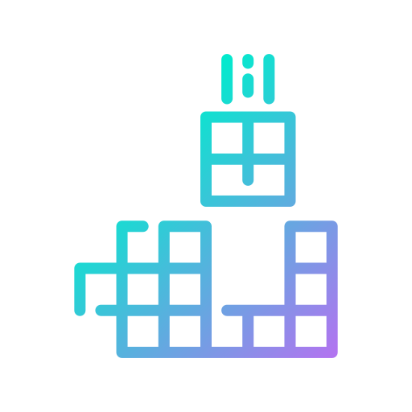

<h1 align="center">Hi 👋, I'm Gabriel</h1>
<h3 align="center">"First, solve the problem. Then, write the code." — John Johnson</h3>
<h3 align="center">✨✨🪄 Bibbidi Bobbidi Boo ✨✨🪄</h3>

---

- 🔭 I’m currently working on **learning, learning, learning!**
- 🌱 I’m currently learning **Rust**
- 📫 How to reach me **gabrielipcarvalho@gmail.com**
- ⚡ Fun fact **Beat me at Tetris, if you can.** 

---

<h3 align="left">Connect with me:</h3>

  

---

<h3 align="left">TechStack:</h3>

<h4 align="left">Front-end:</h4>

  
  
  
  
  

<h4 align="left">Mobile:</h4>

  
  

<h4 align="left">Back-end:</h4>

  
  
  

<h4 align="left">Database:</h4>

  
  

<h4 align="left">DevOps:</h4>

  
  
  
  
  
  

<h4 align="left">Systems:</h4>

  
  

<h4 align="left">AI and Machine Learning:</h4>

  
  

